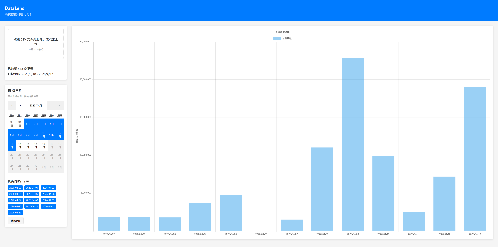

# DataLens

MiniMax Token 账单可视化分析工具。



## 功能特性

- **CSV 上传**：支持拖拽或点击上传 MiniMax 导出的账单 CSV 文件
- **日期选择**：
  - 单击选择单日
  - 拖拽选择连续日期范围
- **单日视图**：折线图展示一天内 24 小时消费趋势，标注峰值和谷值
- **多日对比**：柱状图对比不同日期的总消费数
- **响应式设计**：适配多种屏幕尺寸

## 快速开始

### 安装依赖

```bash
npm install
```

### 启动开发服务器

```bash
npm run dev
```

启动后访问 `http://localhost:3000`

### 构建生产版本

```bash
npm run build
```

构建产物在 `dist/` 目录

### 运行测试

```bash
npm test
```

## 使用方法

1. **上传 CSV 文件**：将 MiniMax 导出的账单文件拖拽到上传区域
2. **选择日期**：在日历中点击选择单日，或拖拽选择日期范围
3. **查看图表**：
   - 选择单日查看每小时消费趋势折线图
   - 选择多日查看消费对比柱状图

## 技术栈

- React 18
- Vite 5
- Chart.js + react-chartjs-2
- react-calendar
- PapaParse

## 项目结构

```
src/
├── components/     # UI 组件
│   ├── FileUpload.jsx      # 文件上传
│   ├── CalendarPanel.jsx   # 日期选择
│   └── ChartPanel.jsx      # 图表展示
├── context/        # 全局状态
│   └── DataContext.jsx
├── utils/          # 工具函数
│   ├── csvParser.js        # CSV 解析
│   └── dataAggregator.js   # 数据聚合
├── App.jsx         # 主组件
└── main.jsx        # 入口文件
```

## 适用场景

适用于 MiniMax API 用户分析 Token 消费情况，帮助：
- 识别消费高峰时段
- 对比不同日期的使用量
- 优化 API 调用策略